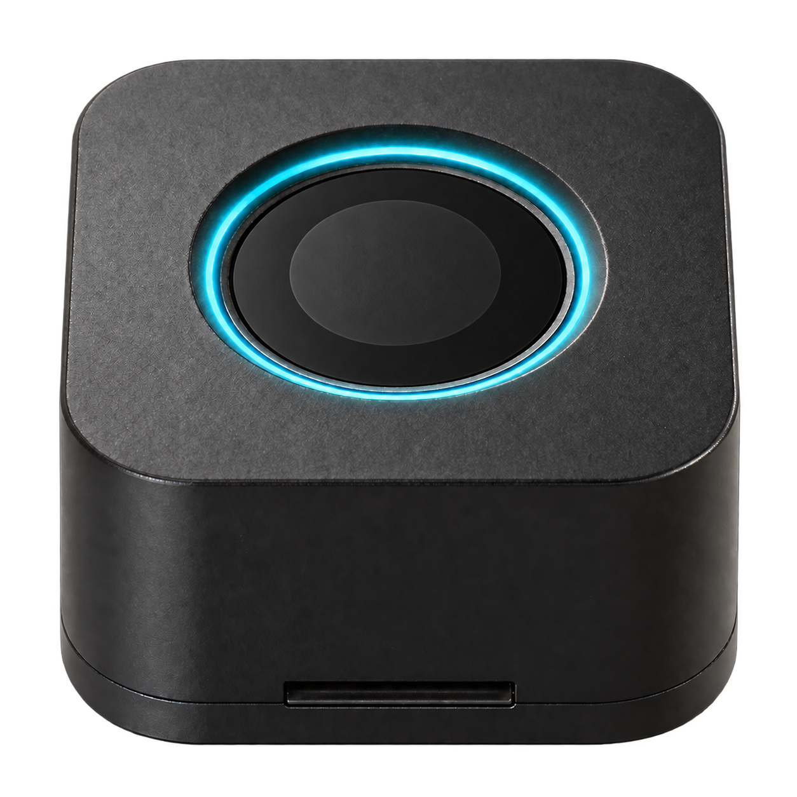
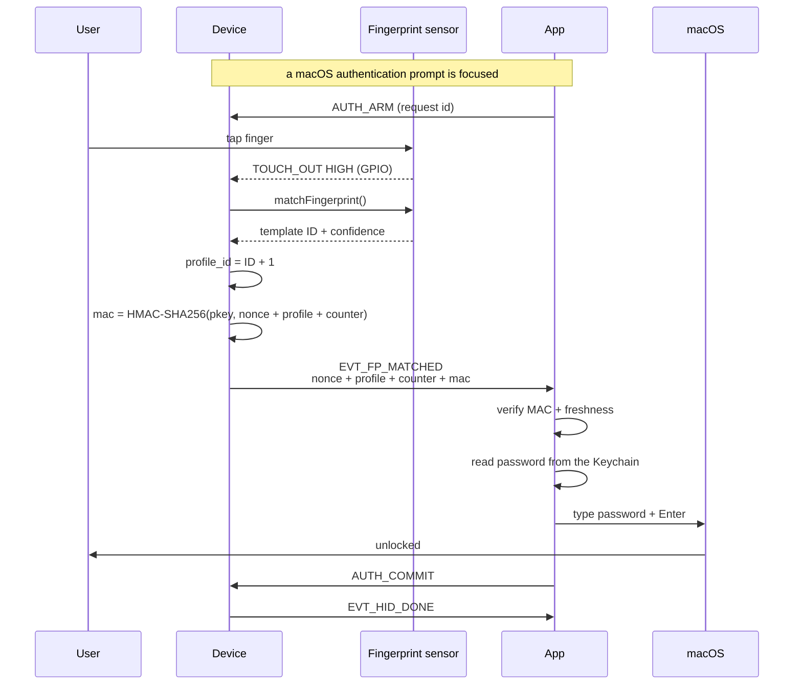

# How FPPBox works

  

FPPBox (Fingerprint Portable Box) is a small device with a fingerprint sensor. Touch it, and your
Mac types your password for you. The password never leaves your Mac.

## Download

## Buy the hardware

## The big picture

1. You tap your finger.
2. The sensor matches it locally (the fingerprint never leaves the device).
3. The device proves the match to the companion app on your Mac with an
   HMAC-signed message.
4. The app verifies that proof and types your password on the Mac. The password
   is never sent to the device, or anywhere else.

## The flow, step by step

## What each part does

| Part | What it does | What it never does |
|---|---|---|
| Fingerprint sensor | Matches your finger locally | Sends the fingerprint anywhere |
| Device | Detects the touch, matches it, signs the proof, wakes a sleeping Mac | Receives, stores, or types the password |
| App (macOS) | Verifies the proof, reads the password from the Keychain, types it into the focused authentication prompt | Sends the password anywhere |

## Why it's safe

- **Fingerprint stays local.** The sensor only reports "match" / "no match".
- **The password never leaves your Mac.** Only a signed proof crosses the USB
  cable; the app types the password locally.
- **Nothing to replay.** Every proof carries a fresh nonce and a counter that
  only moves forward, so a captured proof cannot be used a second time.
- **Nothing to steal from the device.** It holds fingerprint templates and a
  pairing key, not your password.
- **System authentication prompts only.** The app arms the device only while a
  macOS authentication prompt is focused (the lock screen, or a system password
  dialog), never an ordinary password field in a browser or an app.

## FAQ

I set the device up on Mac A. What happens if I plug it into Mac B?

The device is **locked to the Mac that set it up**. Setting it up installs a
pairing key and binds the device to that Mac's host key; another Mac cannot
prove ownership, so:

- It refuses commands from the other Mac's app, which reports **"This device is
  paired to another Mac"**.
- If no app answers at all, a fingerprint touch types nothing.

To move the device to another Mac, reset it first (which erases the enrolled
fingerprints), then set it up again on the new Mac.

Can I use the device on two Macs?

No. A device is bound to one Mac at a time. Using it on a second Mac requires a
reset and a fresh setup there. The pairing key and host binding are what make
the device refuse everybody else.

What should I watch out for?

- Every enrolled finger can trigger the stored password for that device, so
  enroll only fingers you trust.
- The password is typed whenever a macOS authentication prompt is focused,
  the lock screen included. Treat the device like the password itself.

Is anything sent over the internet? Is there a server?

No. Everything is **fully offline** and runs on your own hardware:

- There is **no server**, no cloud, and no internet connection involved at
  any point in the flow.
- The password is **never sent anywhere**, not to the device and not over USB.
  It stays in the app on your Mac and is typed locally, and only after your
  fingerprint matches.
- All cryptographic checks (HMAC verification) happen locally on the device and
  in the app on your Mac.

Where is my auth info stored?

- **Fingerprint:** stored only on the device, inside the fingerprint sensor
  itself. It never leaves the device: the sensor only reports
  "match"/"no match".
- **Password:** stored only in the macOS Keychain on your Mac, never on the
  device and never on any server.
- **Pairing key and host key:** also in the macOS Keychain, in the same item as
  the password, so macOS asks you to allow access once.

Is anything sent anywhere when I touch the sensor?

No. Touching the sensor triggers a local fingerprint match; if it matches, the
device sends a signed proof over the USB cable to the app on the same Mac. The
password is typed by that Mac locally, and nothing leaves your machine.

How many fingers and passwords can I set up?

Up to **12 fingerprints** (the firmware's profile slots; each enrolled finger
takes one). The app stores **one password per device**, not one per finger.
Every enrolled finger triggers that same password, so enrolling more fingers
does not add more passwords.

What does the app need on the Mac?

- **App must be running.** The device proves the match, but the app is what types
  the password. If the app isn't running, a fingerprint touch types nothing.
- **Accessibility permission.** The app uses macOS Accessibility to recognise the
  authentication prompt it is allowed to type into. Grant it in System Settings →
  Privacy & Security → Accessibility.
- **Password in Keychain.** The password is stored in the macOS Keychain, not in
  a file on disk. macOS asks for permission to read it; choosing **Always Allow**
  makes it a one-time question.

Does it work when my Mac is asleep?

Yes. Touch the sensor once: the Mac wakes up and your password is typed for you.
You don't need to touch the keyboard.

Can I use it on the login screen?

The **lock screen** (after you have logged in, screen locked or Mac asleep) is
supported. The **login window before any user logs in** is not: no app session
exists yet to answer the device, so a LaunchAgent that runs the app pre-login is
planned.

I lost the device. What happens?

The device holds no password, only the pairing key and fingerprint templates.
A stolen device without your Mac cannot get the password out. Still, treat a lost
device as compromised:

- Delete the stored password in the app (revoke the pairing key).
- If you recover the device, use the app's **Reset** option to wipe the old
  fingerprints and pairing key, then set it up again from scratch.

Why is my finger sometimes not read, or hard to read?

The sensor is small and compares your live finger against the enrolled
template. If the live read is too different, it reports “no match”. Most
causes are on the finger, not the device:

- **Dry, dirty, oily, or wet finger.** Wipe the sensor and your fingertip
  before touching. Dry fingers are the most common cause of weak reads.
- **Bad placement.** Cover the whole sensor window flat with the pad of your
  finger. Touch with the same finger, same angle, and same orientation you
  used during enrollment.
- **Too quick or sliding.** Keep the finger still on the sensor until the
  matching finishes (or the LED gives up). Sliding or lifting too early aborts
  the read.
- **Weak enrollment.** If the enrolled template was captured in a hurry (or
  from the same dry finger), matches will be unreliable. Enroll again,
  slowly, and, if the sensor supports it, enroll the same finger more than
  once.
- **Wrong finger.** The device only accepts fingerprints it has been
  enrolled with. Enrolled fingers are the only ones that can trigger it.

If a finger that used to work stops working, the template did not change. The
live read did (dry skin, cut, angle). Re-enroll the finger and the
problem usually goes away.

Anything to remember before touching the sensor?

Yes: the password is typed into the focused **macOS authentication prompt**. Make
sure the lock screen or the system password dialog is focused, otherwise nothing
is typed, and the app never types into an ordinary password field at all.

Which operating systems are supported?

Currently **macOS only**: Intel, Apple Silicon, and universal (both in one
build). Windows and Linux are not supported yet.

Do you offer refunds?

No. All sales are final: FPPBox does not offer refunds, returns, or exchanges.
Please check the requirements on this page before ordering.

## Disclaimer

FPPBox is provided "as is", without warranty of any kind. No software or
hardware can guarantee absolute security.

- **Not bulletproof.** A determined attacker with physical access, malware on
  your Mac, or advanced tools may still defeat it.
- **No liability.** The authors are not responsible for leaked, lost, or
  compromised passwords, accounts, or data arising from use of this product.
- **Use at your own risk.** Try it with non-critical accounts first, and keep
  recovery options (backup codes, a password manager) available.
- **Shared device caution.** Anyone whose fingerprint is enrolled can trigger
  a password, and anyone with physical access to the device and a running app
  may be able to.
- **Local threats remain.** A keylogger or other malicious software on your
  Mac can still capture what the device's app types.

### Trademarks and affiliation

FPPBox is an independent product. It is **not affiliated with, endorsed by,
sponsored by, or otherwise associated with Apple Inc.**, nor with any other
company, brand, or product referenced in this document.

Apple, Mac, and macOS are trademarks of Apple Inc., registered in the United
States and other countries. All other product names, logos, brands,
and trademarks mentioned here are the property of their respective owners and
are used for identification purposes only, without intent to infringe.

References to third-party hardware, software, or services are for identification
and compatibility information only. They do not imply any endorsement,
partnership, sponsorship, or warranty by or from those third parties. Third-party
components remain subject to the terms and warranties of their own
manufacturers.
